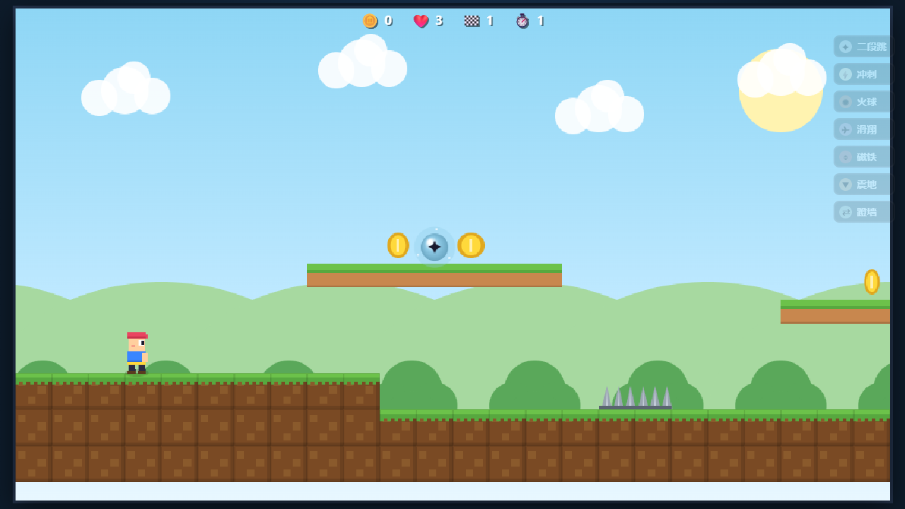
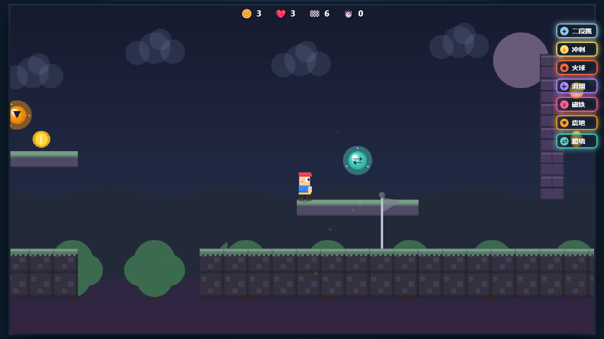

# 像素冒险 Pixel Quest

一个可直接在浏览器中打开的横版像素平台跳跃游戏。玩家需要穿越 12 个主题关卡，收集金币，躲避尖刺、史莱姆和 boss，逐步解锁移动与战斗技能，并在后半段获得技能强化。

## 截图






## 开始游戏

直接用浏览器打开 `index.html` 即可开始。这个项目没有构建步骤，也不需要安装依赖。

如果浏览器对本地文件限制较严格，也可以在项目目录启动一个静态服务器：

```bash
python -m http.server 8000
```

然后访问 `http://localhost:8000/`。

## 存档文件

默认实体存档在 `save/pixel-quest-save.json`，页面每次加载时都会尝试读取它。直接双击 `index.html` 时，部分浏览器会限制读取 JSON 文件，所以项目同时提供 `save/pixel-quest-save.js` 作为本地打开模式的默认存档镜像。

游玩过程中的自动进度会写入浏览器 `localStorage`，键名为 `pixelQuest.save.v2`。商店里的“导出存档”会生成同结构 JSON 文件，可用于备份或替换默认存档。

## 资源替换

关卡地图数据位于 `data/pixel-quest-levels.js`。地图、背景、玩家、怪物、道具和技能特效图片通过 `assets/pixel-quest-assets.js` 的 manifest 挂载；未填写或未加载成功的资源会自动回退到 Canvas 程序化绘制。

地图美术资源绘制提示词见 `docs/art/map-art-prompts.md`。替换图片时请保持 manifest 中的帧尺寸和锚点约定，不要用图片尺寸修改碰撞盒、boss 尺寸或关卡字符。

## 基本目标

每一关的目标都是从出生点出发，穿过平台、敌人、机关和沟壑，抵达终点旗。金币会累计到本局总数，生命耗尽则游戏结束。

## 操作方式

| 动作 | 键盘 |
| --- | --- |
| 左右移动 | `A` / `D` 或方向键左右 |
| 跳跃 | `W`、方向键上或空格 |
| 暂停 | `P` |
| 冲刺 | `Shift`，解锁后可用 |
| 火球 | `J` 或 `X`，解锁后可用 |
| 震地 | 空中按 `S` 或方向键下，解锁后可用 |
| 滑翔 | 空中长按跳跃键，解锁后可用 |
| 蹬墙 | 贴墙下滑时按跳跃，解锁后可用 |

触屏设备会显示虚拟方向键和动作按钮。

## 技能解锁

| 关卡 | 主题 | 解锁内容 | 用途 |
| --- | --- | --- | --- |
| 1 | 草原 | 二段跳 | 空中再跳一次，越过更宽的缺口 |
| 2 | 洞窟 | 冲刺 | 快速横向位移，冲刺期间可撞掉敌人 |
| 3 | 天空 | 火球 | 远距离消灭史莱姆 |
| 4 | 熔岩 | 滑翔 | 长按跳跃降低下落速度，跨越长沟 |
| 5 | 冰雪 | 金币磁铁 | 自动吸附附近金币 |
| 6 | 终焉洞窟 | 震地、蹬墙 | 震地清理敌人，蹬墙探索竖向路线 |
| 7 | 水晶遗迹 | 星跃强化 | 二段跳更高，并获得短暂无伤反馈 |
| 8 | 菌光森林 | 浮游滑翔 | 滑翔下降更慢，首次滑翔轻微上抬 |
| 9 | 机械工坊 | 连环冲刺 | 击败敌人刷新冲刺，落地冷却更快 |
| 10 | 霓虹雨城 | 爆裂火球 | 火球命中后产生小范围爆炸 |
| 11 | 时钟高塔 | 墙面蓄力 | 墙滑更慢，蹬墙跳更强 |
| 12 | 星渊王座 | 裂地冲击 | 震地范围扩大，可打断终局 boss |

## 关卡与规则

当前版本包含 12 个可游玩的主题关卡：草原、洞窟、天空、熔岩、冰雪、终焉洞窟、水晶遗迹、菌光森林、机械工坊、霓虹雨城、时钟高塔和星渊王座。

玩家初始有 3 条生命。碰到尖刺、敌人侧面或掉出世界会损失生命并重生。踩到史莱姆可以消灭它并反弹，冲刺、火球和震地也能击败敌人。

关卡中的绿色复活旗是检查点。触碰后，下一次失误会从最新检查点复活。第 7 关和第 12 关存在 boss，boss 存活时终点旗会被锁定，击败后才能过关。商店中“下次冒险生命 +1”是单局消耗品，会在下一次开局生效并清零。

## 游玩提示

优先吃技能球和强化球，它们通常放在当前关卡需要学习的位置。第 7-12 关默认已经掌握基础技能，路线会更强调技能组合；遇到 boss 关时，先处理 boss 再冲终点。
